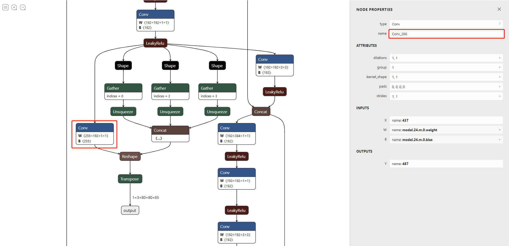
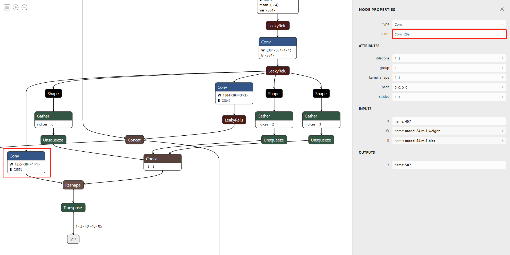
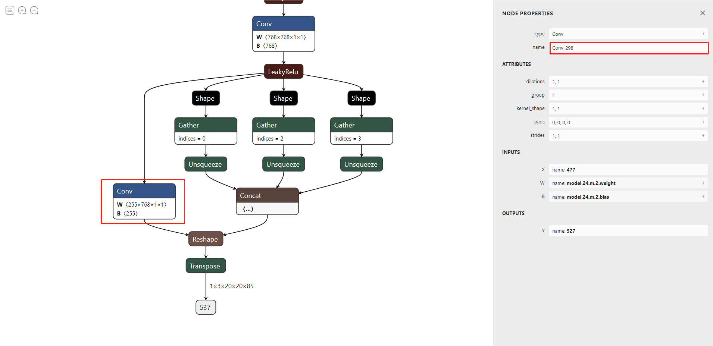

# Ascend Deep-SORT
MOT using deepsort yolov5 with ascend

| Requirement | Version                   |
| ----------- | ------------------------- |
| OS          | Ubuntu 18.04              |
| OpenCV      | 4.x compiled with GCC 7.5 |
| OpenMP      | default with GCC          |
| CANN        | 3.3.0 or above            |

supported Ascend Hardware：Atlas300-3000/3010、Atlas800-3000/3010

### Performance：

<video id="video" height=272 width=480 controls="controls">
    <source src="https://infer-model.obs.cn-north-4.myhuaweicloud.com:443/deepsort/result.mp4?AccessKeyId=9ZDA1G0YE9DZH8KPKRYY&Expires=1662026166&Signature=%2BR9Fo3GdrKGdF6Ne6pIC4hB4e40%3D" type="video/mp4">
</video>


| Hardware  | e2e latency（10 tracks） | FPS  |
| --------- | ------------------------ | ---- |
| Ascend310 | 50ms                     | 20   |

### 1.onnx model trans to ascend model

##### 1.1 modify the focus modular to an Conv operator by scripts/modify_yolov5.py

yolov5m model can be download [here](https://infer-model.obs.cn-north-4.myhuaweicloud.com:443/deepsort/yolov5m.onnx?AccessKeyId=9ZDA1G0YE9DZH8KPKRYY&Expires=1662020514&Signature=S6qZw646TrHtDuiRM0mhi92WMwc%3D)

`python3 modify_yolov5.py yolov5m.onnx yolov5m`

##### 1.2 transfer yolov5.onnx to om with ATC

```shell
source /usr/local/Ascend/ascend-toolkit/set_env.sh
atc --model=yolov5m.onnx --framework=5 --output=yolov5m --soc_version=Ascend310 --insert_op_conf=aipp_rgb_yolo.cfg --input_format=NCHW --input_shape="images:1,3,640,640" --out_nodes="Conv_266:0;Conv_282:0;Conv_298:0" --output_type="Conv_266:0:FP32;Conv_282:0:FP32;Conv_298:0:FP32"

```

| param         | statement                                                    |
| ------------- | ------------------------------------------------------------ |
| --model       | input onnx model                                             |
| --output      | output om file                                               |
| --input_shape | model input shape: (batch, channel, width, height)           |
| --out_nodes   | select model output nodes, node's name in onnx graph         |
| --output_type | define model output nodes' type, the node must corresponding to the items which out_nodes defined |

which nodes you should select:









##### 1.3 trans feature extractor model to om with ATC

feature extractor model can be download [here](https://infer-model.obs.cn-north-4.myhuaweicloud.com:443/deepsort/feature.onnx?AccessKeyId=9ZDA1G0YE9DZH8KPKRYY&Expires=1662020400&Signature=V4PuBePuJxqPS51xdGFCgFvFj6o%3D)

```shell
source /usr/local/Ascend/ascend-toolkit/set_env.sh
atc --model=feature.onnx --framework=5 --output=feature --soc_version=Ascend310 --insert_op_conf=aipp_rgb_feature.cfg --input_format=NCHW --input_shape="input:1,3,128,64"
```

### 2.Compile and Run program

##### 2.1 modify CMakeLists.txt 

```cmake
set(OpenCV_DIR /root/opencv4.4/lib/cmake/opencv4) #your own opencv path
...
set(ACL_PATH /usr/local/Ascend/ascend-toolkit/latest) #your own cann-toolkit path
```

##### 2.2 Compile it

```shell
mkdir build
cd build
cmake ..
make -j8
```

##### 2.3 Run it

```shell
./ACL_DEEPSORT model/yolov5m.om model/feature.om data/test.mp4

===============================
yolov5 infer time:20.759ms
Detections size:9
feature infer time:13.906ms
predict time:0.693ms
update time:11.268ms
fps:21.3538
===============================
```

### Reference:

DeepSORT: https://github.com/shaoshengsong/DeepSORT 

Yolov5_DeepSort_Pytorch: https://github.com/mikel-brostrom/Yolov5_DeepSort_Pytorch
